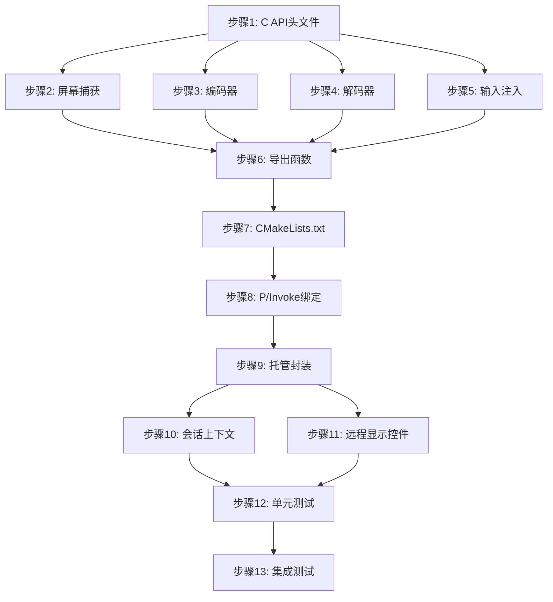

# QuicRemote Phase 2: 核心功能 实施计划

> **For agentic workers:** REQUIRED SUB-SKILL: Use superpowers:subagent-driven-development (recommended) or superpowers:executing-plans to implement this plan task-by-task. Steps use checkbox (`- [ ]`) syntax for tracking.

**Goal:** 实现 QuicRemote 的核心功能，包括屏幕捕获、编码器、解码器、输入注入和基础会话管理。

**Architecture:** 分层单体架构，C++ Native DLL 提供高性能媒体管道，C# 层负责网络通信和业务逻辑，通过 P/Invoke 跨语言调用。

**Tech Stack:** C++20, C#/.NET 8, MsQuic, DXGI Desktop Duplication, NVENC/AMF/QSV, D3D11

**Spec Reference:** `docs/superpowers/specs/2026-03-21-quicremote-design.md`

**Prerequisite:** Phase 1 基础框架已完成

---

## 文件结构规划

```
QuicRemote/
├── src/
│   ├── QuicRemote.Native/
│   │   ├── include/
│   │   │   └── quicremote.h           # 扩展 C API 头文件
│   │   ├── src/
│   │   │   ├── capture.cpp            # DXGI Desktop Duplication 实现
│   │   │   ├── encoder.cpp            # 编码器实现 (NVENC/AMF/QSV)
│   │   │   ├── decoder.cpp            # 解码器实现 (NVDEC/D3D11)
│   │   │   ├── input.cpp              # SendInput API 实现
│   │   │   └── exports.cpp            # API 导出
│   │   ├── internal/
│   │   │   ├── capture.h              # 屏幕捕获内部接口
│   │   │   ├── encoder.h              # 编码器内部接口
│   │   │   ├── decoder.h              # 解码器内部接口
│   │   │   ├── input.h                # 输入注入内部接口
│   │   │   └── d3d_utils.h            # D3D11 工具函数
│   │   └── CMakeLists.txt             # 更新依赖
│   │
│   ├── QuicRemote.Core/
│   │   ├── Session/
│   │   │   ├── SessionManager.cs      # 会话管理
│   │   │   └── SessionContext.cs      # 会话上下文
│   │   ├── Media/
│   │   │   ├── NativeMethods.cs       # P/Invoke 绑定
│   │   │   ├── CaptureWrapper.cs      # 屏幕捕获封装
│   │   │   ├── EncoderWrapper.cs      # 编码器封装
│   │   │   ├── DecoderWrapper.cs      # 解码器封装
│   │   │   └── InputWrapper.cs        # 输入注入封装
│   │   └── Rendering/
│   │       └── D3D11Renderer.cs       # D3D11 渲染器
│   │
│   └── QuicRemote.Client/
│       └── Controls/
│           └── RemoteDisplay.xaml     # 远程桌面显示控件
```

---

## 实施步骤

### 步骤 1: 扩展 C API 头文件定义

**文件:** `src/QuicRemote.Native/include/quicremote.h`

**任务:**
- [x] 1.1 添加帧数据结构 `QR_Frame` (宽度、高度、格式、纹理指针、脏区域)
- [x] 1.2 添加编码包结构 `QR_Packet` (数据指针、大小、时间戳、关键帧标志)
- [x] 1.3 添加编码器配置结构 `QR_EncoderConfig` (编码器类型、编解码器、分辨率、码率、帧率)
- [x] 1.4 添加解码器配置结构 `QR_DecoderConfig` (编解码器类型、最大分辨率)
- [x] 1.5 添加枚举类型 `QR_EncoderType`, `QR_Codec`, `QR_PixelFormat`
- [x] 1.6 添加输入相关枚举 `QR_MouseButton`, `QR_ButtonAction`, `QR_KeyAction`, `QR_KeyCode`
- [x] 1.7 添加屏幕捕获 API 声明
- [x] 1.8 添加编码器 API 声明
- [x] 1.9 添加解码器 API 声明
- [x] 1.10 添加输入注入 API 声明

**验收标准:**
- 头文件编译通过
- 所有结构体和枚举定义完整
- API 函数签名与设计文档一致

---

### 步骤 2: 实现屏幕捕获模块 (DXGI Desktop Duplication)

**文件:** `src/QuicRemote.Native/src/capture.cpp`, `internal/capture.h`

**任务:**
- [x] 2.1 创建 `CaptureManager` 类管理 DXGI Desktop Duplication
- [x] 2.2 实现 D3D11 设备和 DXGI 输出枚举
- [x] 2.3 实现 `IDXGIOutputDuplication` 接口初始化
- [x] 2.4 实现帧获取逻辑 (`AcquireNextFrame`)
- [x] 2.5 实现脏区域检测 (`RECT` 数组)
- [x] 2.6 实现光标形状捕获
- [x] 2.7 实现纹理池管理 (避免频繁分配)
- [x] 2.8 实现桌面切换检测和恢复
- [x] 2.9 实现 `QR_Capture_Start` API
- [x] 2.10 实现 `QR_Capture_GetFrame` API
- [x] 2.11 实现 `QR_Capture_ReleaseFrame` API
- [x] 2.12 实现 `QR_Capture_Stop` API

**验收标准:**
- 能够成功捕获指定显示器桌面
- 支持脏区域检测
- 支持光标捕获
- 帧率稳定 60fps
- 内存无泄漏

---

### 步骤 3: 实现编码器模块

**文件:** `src/QuicRemote.Native/src/encoder.cpp`, `internal/encoder.h`

**任务:**
- [x] 3.1 创建编码器抽象接口 `IEncoder`
- [x] 3.2 创建编码器工厂 `EncoderManager`
- [x] 3.3 实现硬件检测逻辑 (NVENC → AMF → QSV → Software)
- [x] 3.4 实现 NVENC 编码器 (NVIDIA)
  - [x] 3.4.1 初始化 CUDA 和 NVENC
  - [x] 3.4.2 配置编码参数 (低延迟、CBR)
  - [x] 3.4.3 实现纹理到编码器输入
  - [x] 3.4.4 实现帧编码和输出
- [x] 3.5 实现软件编码器 (FFmpeg x264)
  - [x] 3.5.1 初始化 FFmpeg 编码上下文
  - [x] 3.5.2 实现 GPU 到 CPU 纹理拷贝
  - [x] 3.5.3 实现编码和 NAL 包输出
- [x] 3.6 实现编码器热切换支持
- [x] 3.7 实现 `QR_Encoder_Create` API
- [x] 3.8 实现 `QR_Encoder_Encode` API
- [x] 3.9 实现 `QR_Encoder_Destroy` API

**验收标准:**
- 支持硬件编码优先检测
- NVENC 编码成功 (如有 NVIDIA GPU)
- 软件编码作为回退可用
- 编码延迟 ≤ 5ms (1080p)
- 支持 H.264/H.265

---

### 步骤 4: 实现解码器模块

**文件:** `src/QuicRemote.Native/src/decoder.cpp`, `internal/decoder.h`

**任务:**
- [x] 4.1 创建解码器抽象接口 `IDecoder`
- [x] 4.2 创建解码器管理器 `DecoderManager`
- [x] 4.3 实现硬件解码优先检测 (NVDEC → D3D11 → QSV → Software)
- [x] 4.4 实现 NVDEC 解码器 (NVIDIA)
  - [x] 4.4.1 初始化 CUDA 和 NVDEC
  - [x] 4.4.2 实现解码器会话创建
  - [x] 4.4.3 实现帧解码
- [x] 4.5 实现 D3D11 Video Decoder
  - [x] 4.5.1 创建 D3D11 视频设备
  - [x] 4.5.2 配置解码器格式
  - [x] 4.5.3 实现解码流程
- [x] 4.6 实现软件解码器 (FFmpeg)
  - [x] 4.6.1 初始化 FFmpeg 解码上下文
  - [x] 4.6.2 实现 CPU 解码
  - [x] 4.6.3 实现输出到 D3D11 纹理
- [x] 4.7 实现解码器重置 (关键帧请求)
- [x] 4.8 实现 `QR_Decoder_Create` API
- [x] 4.9 实现 `QR_Decoder_Decode` API
- [x] 4.10 实现 `QR_Decoder_Destroy` API

**验收标准:**
- 支持硬件解码优先
- 解码延迟 ≤ 3ms (1080p)
- 支持 H.264/H.265
- 输出为 D3D11 纹理

---

### 步骤 5: 实现输入注入模块

**文件:** `src/QuicRemote.Native/src/input.cpp`, `internal/input.h`

**任务:**
- [x] 5.1 创建 `InputInjector` 类
- [x] 5.2 实现鼠标移动注入 (`SendInput` with `MOUSEEVENTF_MOVE`)
- [x] 5.3 实现鼠标点击注入 (左键、右键、中键)
- [x] 5.4 实现鼠标滚轮注入
- [x] 5.5 实现键盘按键注入 (虚拟键码映射)
- [x] 5.6 实现组合键支持 (Ctrl/Alt/Shift + Key)
- [x] 5.7 实现 DPI 缩放适配
- [x] 5.8 实现权限检测 (UIPI)
- [x] 5.9 实现 `QR_Input_MouseMove` API
- [x] 5.10 实现 `QR_Input_MouseButton` API
- [x] 5.11 实现 `QR_Input_MouseWheel` API
- [x] 5.12 实现 `QR_Input_Key` API

**验收标准:**
- 鼠标移动流畅，坐标准确
- 支持所有鼠标按钮和滚轮
- 支持所有键盘按键和组合键
- DPI 缩放正确
- 权限不足时返回正确错误码

---

### 步骤 6: 实现导出函数

**文件:** `src/QuicRemote.Native/src/exports.cpp`

**任务:**
- [x] 6.1 导出所有新增 API 函数
- [x] 6.2 更新版本号
- [x] 6.3 更新 `QR_GetErrorDescription` 支持新错误码

**验收标准:**
- DLL 导出符号正确
- P/Invoke 可正确调用

---

### 步骤 7: 更新 CMakeLists.txt

**文件:** `src/QuicRemote.Native/CMakeLists.txt`

**任务:**
- [x] 7.1 添加 FFmpeg 依赖
- [x] 7.2 添加 CUDA/NVENC 依赖 (可选)
- [x] 7.3 添加新的头文件目录
- [x] 7.4 更新链接库列表

**验收标准:**
- CMake 配置成功
- 项目编译通过

---

### 步骤 8: 创建 C# P/Invoke 绑定

**文件:** `src/QuicRemote.Core/Media/NativeMethods.cs`

**任务:**
- [x] 8.1 定义所有新增结构体 (使用 `StructLayout`)
- [x] 8.2 定义所有枚举类型
- [x] 8.3 定义 `SafeHandle` 子类 (`NativeFrameHandle`, `EncoderHandle`, `DecoderHandle`)
- [x] 8.4 定义所有 API 函数的 P/Invoke 签名
- [x] 8.5 添加错误处理辅助方法

**验收标准:**
- P/Invoke 签名与 C API 一致
- SafeHandle 正确释放资源

---

### 步骤 9: 创建托管封装类

**文件:** `src/QuicRemote.Core/Media/*.cs`

**任务:**
- [x] 9.1 创建 `CaptureWrapper` 类
  - [x] 9.1.1 实现 `StartCapture` 方法
  - [x] 9.1.2 实现 `GetFrame` 方法 (返回 `FrameData` 类)
  - [x] 9.1.3 实现 `StopCapture` 方法
- [x] 9.2 创建 `EncoderWrapper` 类
  - [x] 9.2.1 实现 `Create` 方法
  - [x] 9.2.2 实现 `Encode` 方法
  - [x] 9.2.3 实现 `Destroy` 方法
- [x] 9.3 创建 `DecoderWrapper` 类
  - [x] 9.3.1 实现 `Create` 方法
  - [x] 9.3.2 实现 `Decode` 方法
  - [x] 9.3.3 实现 `Destroy` 方法
- [x] 9.4 创建 `InputWrapper` 类
  - [x] 9.4.1 实现 `MouseMove` 方法
  - [x] 9.4.2 实现 `MouseButton` 方法
  - [x] 9.4.3 实现 `MouseWheel` 方法
  - [x] 9.4.4 实现 `Key` 方法

**验收标准:**
- 封装类提供友好的 C# API
- 正确处理错误和异常
- 资源管理正确

---

### 步骤 10: 实现会话上下文

**文件:** `src/QuicRemote.Core/Session/SessionContext.cs`

**任务:**
- [x] 10.1 定义 `SessionContext` 类
- [x] 10.2 集成 `CaptureWrapper` (被控端)
- [x] 10.3 集成 `EncoderWrapper` (被控端)
- [x] 10.4 集成 `DecoderWrapper` (控制端)
- [x] 10.5 集成 `InputWrapper` (被控端)
- [x] 10.6 实现媒体管道启动/停止逻辑
- [x] 10.7 实现帧回调机制

**验收标准:**
- 会话上下文正确管理所有媒体组件
- 支持启动和停止媒体管道

---

### 步骤 11: 实现远程显示控件

**文件:** `src/QuicRemote.Client/Controls/RemoteDisplay.xaml`

**任务:**
- [x] 11.1 创建 `RemoteDisplay` 控件 (继承 `FrameworkElement`)
- [x] 11.2 实现 D3D11 渲染表面 (`D3D11Image`)
- [x] 11.3 实现帧接收和渲染循环
- [x] 11.4 实现输入事件捕获 (鼠标、键盘)
- [x] 11.5 实现输入事件序列化和发送

**验收标准:**
- 显示控件能渲染远程桌面
- 输入事件能正确捕获和发送

---

### 步骤 12: 编写单元测试

**文件:** `src/QuicRemote.Native/tests/`, `src/QuicRemote.Core.Tests/`

**任务:**
- [x] 12.1 编写 C++ 捕获模块测试
- [x] 12.2 编写 C++ 编码器测试
- [x] 12.3 编写 C++ 解码器测试
- [x] 12.4 编写 C++ 输入注入测试
- [x] 12.5 编写 C# P/Invoke 绑定测试
- [x] 12.6 编写 C# 封装类测试

**验收标准:**
- 所有测试通过
- 代码覆盖率 ≥ 70%

---

### 步骤 13: 集成测试和验证

**任务:**
- [ ] 13.1 验证捕获 → 编码 → 解码 → 渲染流水线 (需要编译原生DLL)
- [ ] 13.2 测量端到端延迟
- [ ] 13.3 验证输入注入正确性
- [ ] 13.4 验证内存使用和泄漏
- [ ] 13.5 验证编码器热切换

**注意:** 步骤 13 需要先编译 QuicRemote.Native.dll 并在真实硬件上运行。

**验收标准:**
- 局域网端到端延迟 ≤ 30ms
- 内存使用 ≤ 200MB
- 无内存泄漏

---

## 依赖关系图



---

## 技术要点

### 屏幕捕获 (DXGI Desktop Duplication)
- 使用 `IDXGIOutputDuplication` 接口捕获桌面
- 支持脏区域检测减少编码工作量
- 光标独立传输实现精确光标渲染
- 纹理池复用避免频繁分配

### 编码器
- 硬件优先级: NVENC → AMF → QSV → FFmpeg (x264/x265)
- 低延迟模式: 低 GOP、低 B 帧
- 码率控制: CBR 优先保证稳定延迟
- 支持热切换: 故障时自动降级

### 解码器
- 硬件优先级: NVDEC → D3D11 Video Decoder → QSV → FFmpeg
- 零拷贝输出: D3D11 纹理直接渲染
- 快速重置: 关键帧请求恢复解码

### 输入注入
- SendInput API 实现
- DPI 缩放适配
- UIPI 权限处理

---

## 性能目标

| 指标 | 目标值 |
|------|--------|
| 屏幕捕获延迟 | ≤ 2ms |
| 编码延迟 (1080p) | ≤ 5ms |
| 解码延迟 (1080p) | ≤ 3ms |
| 端到端延迟 (局域网) | ≤ 30ms |
| 帧率 | ≥ 60fps |
| 内存占用 | ≤ 200MB |
| GPU 占用 | ≤ 30% |

---

## 风险与缓解

| 风险 | 影响 | 缓解措施 |
|------|------|---------|
| 硬件编码器不可用 | 高 | 实现软件编码回退 |
| DXGI 桌面切换 | 中 | 实现自动重连逻辑 |
| DPI 缩放问题 | 中 | 实现坐标转换 |
| 权限不足 | 低 | 返回明确错误码 |

---

## 完成标准

- [x] 所有 13 个步骤完成 (步骤 13 需要编译原生DLL后执行)
- [x] 所有测试通过 (80 个单元测试)
- [ ] 性能指标达标 (需要集成测试)
- [ ] 代码审查通过
- [ ] 文档更新完成
