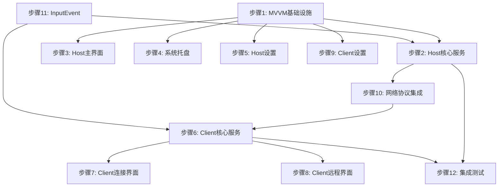

# QuicRemote Phase 3: WPF 应用程序 实施计划

> **For agentic workers:** REQUIRED SUB-SKILL: Use superpowers:subagent-driven-development (recommended) or superpowers:executing-plans to implement this plan task-by-task. Steps use checkbox (`- [ ]`) syntax for tracking.

**Goal:** 实现完整的 WPF 被控端和控制端应用程序，集成 Native DLL 和网络层，实现端到端的远程桌面功能。

**Architecture:** MVVM 架构，WPF UI 层通过 ViewModel 调用 Core 层服务，Core 层通过 P/Invoke 调用 Native DLL。

**Tech Stack:** WPF, .NET 8, MVVM Toolkit, MsQuic

**Spec Reference:** `docs/superpowers/specs/2026-03-21-quicremote-design.md`

**Prerequisite:** Phase 1 和 Phase 2 已完成

---

## 文件结构规划

```
QuicRemote/
├── src/
│   ├── QuicRemote.Host/                 # 被控端 WPF 应用
│   │   ├── App.xaml(.cs)
│   │   ├── MainWindow.xaml(.cs)
│   │   ├── Views/
│   │   │   ├── SettingsView.xaml(.cs)
│   │   │   └── ConnectionView.xaml(.cs)
│   │   ├── ViewModels/
│   │   │   ├── MainViewModel.cs
│   │   │   ├── SettingsViewModel.cs
│   │   │   └── ConnectionViewModel.cs
│   │   ├── Services/
│   │   │   ├── HostService.cs           # 被控端核心服务
│   │   │   ├── TrayIconService.cs       # 系统托盘
│   │   │   └── NotificationService.cs   # 通知服务
│   │   └── Converters/
│   │
│   ├── QuicRemote.Client/               # 控制端 WPF 应用
│   │   ├── App.xaml(.cs)
│   │   ├── MainWindow.xaml(.cs)
│   │   ├── Views/
│   │   │   ├── ConnectView.xaml(.cs)
│   │   │   ├── RemoteView.xaml(.cs)
│   │   │   └── SettingsView.xaml(.cs)
│   │   ├── ViewModels/
│   │   │   ├── MainViewModel.cs
│   │   │   ├── ConnectViewModel.cs
│   │   │   ├── RemoteViewModel.cs
│   │   │   └── SettingsViewModel.cs
│   │   ├── Services/
│   │   │   └── ClientService.cs         # 控制端核心服务
│   │   ├── Controls/
│   │   │   └── RemoteDisplay.xaml(.cs)  # 已实现
│   │   └── Converters/
│   │
│   └── QuicRemote.Core/
│       ├── Session/
│       │   ├── SessionContext.cs        # 已实现
│       │   ├── SessionManager.cs        # 已实现
│       │   └── ConnectionState.cs       # 新增
│       └── Media/
│           ├── NativeMethods.cs         # 已实现
│           ├── CaptureWrapper.cs        # 已实现
│           ├── EncoderWrapper.cs        # 已实现
│           ├── DecoderWrapper.cs        # 已实现
│           ├── InputWrapper.cs          # 已实现
│           └── InputEvent.cs            # 新增
```

---

## 实施步骤

### 步骤 1: 添加 MVVM 基础设施

**文件:** `src/QuicRemote.Host/`, `src/QuicRemote.Client/`

**任务:**
- [ ] 1.1 添加 CommunityToolkit.Mvvm NuGet 包到两个项目
- [ ] 1.2 创建 ViewModelBase 基类 (如果需要)
- [ ] 1.3 创建 RelayCommand 和 ObservableProperty 使用模式

**验收标准:**
- MVVM 包正确安装
- 基础设施可用于 ViewModel 开发

---

### 步骤 2: 实现 Host 被控端核心服务

**文件:** `src/QuicRemote.Host/Services/HostService.cs`

**任务:**
- [ ] 2.1 创建 `HostService` 类管理被控端生命周期
- [ ] 2.2 实现屏幕捕获启动/停止
- [ ] 2.3 实现编码器初始化
- [ ] 2.4 实现网络监听 (QUIC)
- [ ] 2.5 实现客户端连接处理
- [ ] 2.6 实现帧发送逻辑
- [ ] 2.7 实现输入事件接收和注入
- [ ] 2.8 实现会话状态管理

**验收标准:**
- 服务能启动监听
- 能接受客户端连接
- 能发送屏幕帧
- 能接收并注入输入

---

### 步骤 3: 实现 Host MainWindow 和 ViewModel

**文件:** `src/QuicRemote.Host/MainWindow.xaml(.cs)`, `ViewModels/MainViewModel.cs`

**任务:**
- [ ] 3.1 创建 `MainViewModel` 类
- [ ] 3.2 实现连接状态显示
- [ ] 3.3 实现当前会话信息显示
- [ ] 3.4 实现启动/停止按钮
- [ ] 3.5 实现设置入口
- [ ] 3.6 设计简洁的主界面

**验收标准:**
- 界面正确显示状态
- 按钮功能正常
- MVVM 绑定正确

---

### 步骤 4: 实现 Host 系统托盘

**文件:** `src/QuicRemote.Host/Services/TrayIconService.cs`

**任务:**
- [ ] 4.1 创建 `TrayIconService` 类
- [ ] 4.2 实现托盘图标显示
- [ ] 4.3 实现右键菜单 (显示窗口、退出)
- [ ] 4.4 实现最小化到托盘
- [ ] 4.5 实现开机自启动选项

**验收标准:**
- 托盘图标正常显示
- 右键菜单功能正常
- 最小化行为正确

---

### 步骤 5: 实现 Host 设置界面

**文件:** `src/QuicRemote.Host/Views/SettingsView.xaml(.cs)`, `ViewModels/SettingsViewModel.cs`

**任务:**
- [ ] 5.1 创建 `SettingsViewModel` 类
- [ ] 5.2 实现监听端口设置
- [ ] 5.3 实现显示器选择
- [ ] 5.4 实现编码器选择
- [ ] 5.5 实现码率/帧率设置
- [ ] 5.6 实现密码保护设置
- [ ] 5.7 实现设置持久化

**验收标准:**
- 设置界面完整
- 设置能正确保存和加载
- 设置更改能生效

---

### 步骤 6: 实现 Client 控制端核心服务

**文件:** `src/QuicRemote.Client/Services/ClientService.cs`

**任务:**
- [ ] 6.1 创建 `ClientService` 类管理控制端生命周期
- [ ] 6.2 实现 QUIC 连接建立
- [ ] 6.3 实现帧接收和解码
- [ ] 6.4 实现输入事件捕获和发送
- [ ] 6.5 实现连接状态管理
- [ ] 6.6 实现断线重连逻辑

**验收标准:**
- 服务能建立连接
- 能接收并解码帧
- 能发送输入事件
- 状态管理正确

---

### 步骤 7: 实现 Client 连接界面

**文件:** `src/QuicRemote.Client/Views/ConnectView.xaml(.cs)`, `ViewModels/ConnectViewModel.cs`

**任务:**
- [ ] 7.1 创建 `ConnectViewModel` 类
- [ ] 7.2 实现主机地址输入
- [ ] 7.3 实现端口输入
- [ ] 7.4 实现密码输入
- [ ] 7.5 实现连接按钮
- [ ] 7.6 实现历史连接列表
- [ ] 7.7 实现连接状态显示

**验收标准:**
- 界面完整
- 能发起连接
- 状态显示正确

---

### 步骤 8: 实现 Client 远程桌面界面

**文件:** `src/QuicRemote.Client/Views/RemoteView.xaml(.cs)`, `ViewModels/RemoteViewModel.cs`

**任务:**
- [ ] 8.1 创建 `RemoteViewModel` 类
- [ ] 8.2 集成 `RemoteDisplay` 控件
- [ ] 8.3 实现全屏模式切换
- [ ] 8.4 实现工具栏 (断开、设置、全屏)
- [ ] 8.5 实现状态栏 (延迟、帧率、码率)
- [ ] 8.6 实现快捷键支持 (Ctrl+Alt+Del 等)

**验收标准:**
- 远程桌面正常显示
- 工具栏功能正常
- 全屏切换正常
- 状态栏信息正确

---

### 步骤 9: 实现 Client 设置界面

**文件:** `src/QuicRemote.Client/Views/SettingsView.xaml(.cs)`, `ViewModels/SettingsViewModel.cs`

**任务:**
- [ ] 9.1 创建 `SettingsViewModel` 类
- [ ] 9.2 实现解码器设置
- [ ] 9.3 实现缩放模式设置
- [ ] 9.4 实现快捷键设置
- [ ] 9.5 实现设置持久化

**验收标准:**
- 设置界面完整
- 设置能正确保存和加载

---

### 步骤 10: 实现网络消息协议集成

**文件:** `src/QuicRemote.Core/Session/`

**任务:**
- [ ] 10.1 创建 `ConnectionState` 枚举
- [ ] 10.2 实现帧数据序列化
- [ ] 10.3 实现输入事件序列化
- [ ] 10.4 实现控制消息序列化
- [ ] 10.5 集成到 SessionContext

**验收标准:**
- 消息能正确序列化/反序列化
- 网络传输正常

---

### 步骤 11: 创建 InputEvent 类型

**文件:** `src/QuicRemote.Core/Media/InputEvent.cs`

**任务:**
- [ ] 11.1 创建 `InputEvent` 类
- [ ] 11.2 定义输入事件类型枚举
- [ ] 11.3 实现序列化方法
- [ ] 11.4 实现 `InputWrapper` 事件发送

**验收标准:**
- InputEvent 定义完整
- 能正确传递输入事件

---

### 步骤 12: 集成测试

**任务:**
- [ ] 12.1 本地回环测试 (Host 和 Client 在同一机器)
- [ ] 12.2 测试连接建立
- [ ] 12.3 测试屏幕传输
- [ ] 12.4 测试输入注入
- [ ] 12.5 测试断开重连
- [ ] 12.6 测试性能指标

**验收标准:**
- 本地回环延迟 ≤ 10ms
- 帧率 ≥ 60fps
- 输入响应流畅

---

## 依赖关系图



---

## 性能目标

| 指标 | 目标值 |
|------|--------|
| 本地回环延迟 | ≤ 10ms |
| 局域网延迟 | ≤ 30ms |
| 帧率 | ≥ 60fps |
| 内存占用 | ≤ 200MB |
| CPU 占用 | ≤ 15% (办公) |
| 启动时间 | ≤ 2s |

---

## 风险与缓解

| 风险 | 影响 | 缓解措施 |
|------|------|---------|
| D3D11 渲染问题 | 高 | 使用 WriteableBitmap 作为回退 |
| QUIC 连接问题 | 高 | 实现 TCP 回退 |
| 权限问题 | 中 | 提示用户以管理员运行 |
| DPI 缩放问题 | 中 | 实现坐标转换 |

---

## 完成标准

- [ ] 所有 12 个步骤完成
- [ ] 本地回环测试通过
- [ ] 性能指标达标
- [ ] 代码审查通过
- [ ] 文档更新完成
