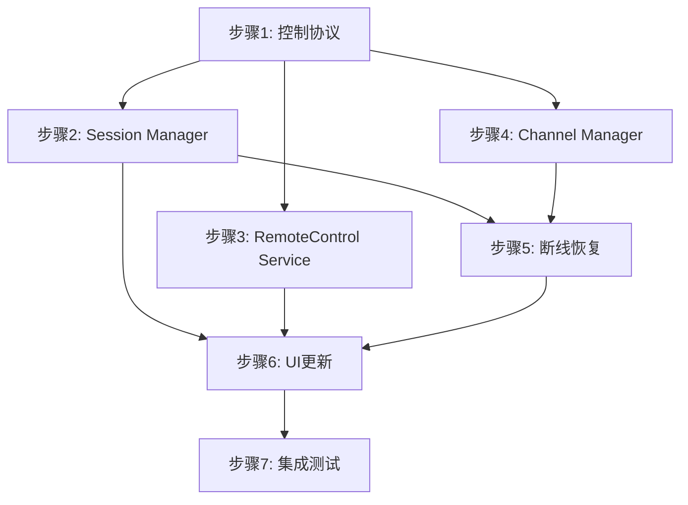

# QuicRemote Phase 4: 远程控制核心能力补齐

> **For agentic workers:** REQUIRED SUB-SKILL: Use superpowers:subagent-driven-development (recommended) or superpowers:executing-plans to implement this plan task-by-task. Steps use checkbox (`- [ ]`) syntax for tracking.

**Goal:** 将"远程媒体传输骨架"升级为完整的"远程控制系统"，补齐输入控制、会话管理、控制协议、断线恢复等核心能力。

**Architecture:** 在现有分层基础上，增强 Core 层会话管理能力，细化 Network 层流通道设计，完善 Native 层输入注入。

**Tech Stack:** WPF, .NET 8, MVVM Toolkit, MsQuic

**Spec Reference:** `docs/superpowers/specs/2026-03-21-quicremote-design.md`

**Prerequisite:** Phase 3 已完成 (WPF 应用程序)

---

## 问题分析

### 当前架构不足

当前系统更接近"远程媒体传输骨架"，距离完整远程控制产品还需补齐：

| 优先级 | 问题 | 说明 |
|--------|------|------|
| P0 | 缺少 RemoteControl Service | 输入控制未作为一等公民建模 |
| P0 | 缺少 Session Manager | 无会话生命周期管理 |
| P0 | 控制协议未显式定义 | 消息类型易膨胀，调试困难 |
| P0 | 断线恢复机制不完整 | 有重连逻辑，缺会话状态恢复 |
| P1 | 多显示器支持不完善 | 缺动态切换和坐标映射 |
| P1 | Clipboard/FileTransfer 缺失 | 基础功能未实现 |
| P1 | 权限模型粗糙 | 仅密码验证，无细粒度权限 |

---

## 现有代码基础

### 已有协议层 (需扩展而非新建)

**Network/Protocol/MessageTypes.cs** - 已有：
- `MessageType` 枚举 (SessionRequest, Heartbeat, MouseEvent, KeyboardEvent 等)
- `Message` 基类 (带 CRC32 校验的序列化)
- `SessionRequestMessage`, `HeartbeatMessage`, `MouseEventMessage`, `KeyboardEventMessage`

**Core/Session/SessionContext.cs** - 已有：
- `SessionState` 枚举 (Idle, Connecting, Active, Failed, Disconnected)
- `InputEvent` 类, `InputEventType` 枚举
- `ControlMessageType` 枚举 (Ping, Pong, AuthRequest, AuthResponse, ConfigUpdate)
- `ControlMessage` 基类, `AuthRequestMessage`, `AuthResponseMessage`, `ConfigUpdateMessage`

### 设计决策

1. **协议统一**：扩展 `Network/Protocol/MessageType`，迁移 `ControlMessage` 到 Network 层
2. **会话扩展**：扩展现有 `SessionState` 和 `SessionContext`，添加角色管理
3. **服务整合**：`SessionManager` 作为新组件，`HostService`/`ClientService` 委托给它
4. **多流渐进**：先单流多路复用，后续再迁移到多流架构

---

## 文件结构规划

```
QuicRemote/
├── src/
│   ├── QuicRemote.Core/
│   │   ├── Session/
│   │   │   ├── SessionContext.cs          # [已有] 扩展角色管理
│   │   │   ├── SessionManager.cs          # [新增] 会话生命周期管理
│   │   │   ├── SessionRole.cs             # [新增] 角色枚举
│   │   │   └── ControlPermission.cs       # [新增] 控制权限管理
│   │   │
│   │   ├── Control/
│   │   │   ├── RemoteControlService.cs    # [新增] 远程控制核心服务
│   │   │   └── CoordinateMapper.cs        # [新增] DPI/多显示器坐标映射
│   │   │
│   │   ├── Recovery/
│   │   │   ├── SessionSnapshot.cs         # [新增] 会话快照
│   │   │   └── RecoveryManager.cs         # [新增] 恢复管理器
│   │   │
│   │   └── Media/                         # [已存在]
│   │
│   ├── QuicRemote.Network/
│   │   ├── Protocol/
│   │   │   ├── MessageTypes.cs            # [已有] 扩展消息类型
│   │   │   ├── Message.cs                 # [已有]
│   │   │   ├── ControlMessages.cs         # [迁移] 从 Core/Session 迁移
│   │   │   ├── SessionMessages.cs         # [新增] 会话控制消息
│   │   │   └── DisplayConfigMessage.cs    # [新增] 显示器配置交换
│   │   │
│   │   ├── Channels/
│   │   │   └── ChannelManager.cs          # [新增] 多路复用管理
│   │   │
│   │   └── Quic/                          # [已存在]
│   │
│   ├── QuicRemote.Host/
│   │   ├── Services/
│   │   │   └── HostService.cs             # [已有] 集成 SessionManager
│   │   ├── ViewModels/
│   │   │   └── SessionViewModel.cs        # [新增] 会话控制
│   │   └── Views/
│   │       └── SessionControlView.xaml    # [新增] 会话控制面板
│   │
│   └── QuicRemote.Client/
│       ├── Services/
│       │   └── ClientService.cs           # [已有] 集成 SessionManager
│       ├── ViewModels/
│       │   └── SessionViewModel.cs        # [新增] 会话控制
│       └── Views/
│           └── SessionControlView.xaml    # [新增] 会话控制面板
│
└── tests/
    └── QuicRemote.Core.Tests/
        ├── SessionManagerTests.cs         # [新增]
        ├── ControlServiceTests.cs         # [新增]
        └── RecoveryTests.cs               # [新增]
```

---

## 实施步骤

### 步骤 1: 扩展协议层

**文件:** `src/QuicRemote.Network/Protocol/`

**任务:**
- [x] 1.1 扩展 `MessageType` 添加新消息类型 (PermissionGrant/Revoke, DisplayConfig, ControlRequest)
- [x] 1.2 迁移 `ControlMessage` 及其子类到 `Network/Protocol/ControlMessages.cs`
- [x] 1.3 创建 `SessionMessages.cs` 定义会话控制消息 (RoleChange, ControlRequest, PermissionResponse)
- [x] 1.4 创建 `DisplayConfigMessage.cs` 用于 DPI/显示器信息交换
- [x] 1.5 在 `SessionContext` 中添加协议版本号常量

**验收标准:**
- [x] 新消息类型正确序列化/反序列化
- [x] 现有代码兼容新协议
- [x] 单元测试覆盖新消息类型 (22 tests)

---

### 步骤 2: 实现 Session Manager

**文件:** `src/QuicRemote.Core/Session/`

**任务:**
- [x] 2.1 创建 `SessionRole` 枚举 (Host, Controller, Viewer)
- [x] 2.2 扩展 `SessionState` 添加 Paused 状态
- [x] 2.3 创建 `ControlPermission` 权限模型 (View, Control, FullControl)
- [x] 2.4 创建 `SessionManager` 会话生命周期管理
- [x] 2.5 实现控制权申请/释放逻辑
- [x] 2.6 实现多客户端接入管理 (线程安全)
- [x] 2.7 添加会话事件 (SessionStarted, SessionEnded, RoleChanged, PermissionChanged)

**验收标准:**
- [x] 会话状态机正确工作
- [x] 控制权申请/释放流程正常
- [x] 线程安全，多客户端场景正确处理 (21 tests)

---

### 步骤 3: 实现 RemoteControl Service

**文件:** `src/QuicRemote.Core/Control/`

**任务:**
- [x] 3.1 创建 `RemoteControlService` 统一输入管理
- [x] 3.2 创建 `CoordinateMapper` DPI/多显示器坐标映射
- [x] 3.3 实现显示器配置交换 (Host 发送显示器信息)
- [x] 3.4 实现客户端坐标到远程坐标的映射
- [x] 3.5 集成现有 `InputWrapper` 进行输入注入
- [x] 3.6 实现输入权限校验 (检查 ControlPermission)

**验收标准:**
- [x] 输入事件正确注入
- [x] DPI 缩放坐标正确
- [x] 多显示器坐标映射正确
- [x] 权限校验有效 (18 tests)

---

### 步骤 4: 整合到 HostService/ClientService

**文件:** `src/QuicRemote.Host/Services/`, `src/QuicRemote.Client/Services/`

**任务:**
- [ ] 4.1 在 `HostService` 中集成 `SessionManager`
- [ ] 4.2 在 `HostService` 中集成 `RemoteControlService`
- [ ] 4.3 在 `ClientService` 中集成 `SessionManager`
- [ ] 4.4 更新消息处理逻辑使用新协议
- [ ] 4.5 添加会话状态到服务层
- [ ] 4.6 实现控制权请求/响应流程

**验收标准:**
- 服务层正确使用 SessionManager
- 协议消息正确处理
- 现有功能不受影响

---

### 步骤 5: 实现断线恢复机制

**文件:** `src/QuicRemote.Core/Recovery/`

**任务:**
- [ ] 5.1 创建 `SessionSnapshot` 会话状态快照
- [ ] 5.2 创建 `RecoveryManager` 恢复管理器
- [ ] 5.3 实现会话状态持久化 (当前角色、权限、显示器配置)
- [ ] 5.4 整合到 `ClientService` 现有重连逻辑
- [ ] 5.5 实现重连后状态恢复
- [ ] 5.6 实现请求完整帧 (避免花屏)

**验收标准:**
- 断线后能自动恢复
- 会话状态正确恢复
- 屏幕内容同步正确

---

### 步骤 6: 更新 UI 层

**文件:** `src/QuicRemote.Host/`, `src/QuicRemote.Client/`

**任务:**
- [ ] 6.1 创建 `SessionViewModel` 会话控制
- [ ] 6.2 创建 `SessionControlView` 会话控制面板
- [ ] 6.3 实现连接/断开控制
- [ ] 6.4 实现观看/控制模式切换 (请求控制权)
- [ ] 6.5 实现屏幕选择功能
- [ ] 6.6 实现状态显示 (延迟、帧率、连接模式)
- [ ] 6.7 集成到现有 MainWindow

**验收标准:**
- UI 正确反映会话状态
- 控制权切换正常
- 多屏幕选择正常

---

### 步骤 7: 集成测试

**任务:**
- [ ] 7.1 协议序列化/反序列化测试
- [ ] 7.2 会话生命周期测试
- [ ] 7.3 控制权切换测试
- [ ] 7.4 多客户端测试
- [ ] 7.5 断线恢复测试
- [ ] 7.6 端到端集成测试

**验收标准:**
- 所有单元测试通过
- 集成测试通过
- 性能指标达标

---

## 依赖关系图



---

## 性能目标

| 指标 | 目标值 |
|------|--------|
| 输入延迟 | ≤ 16ms (60fps) |
| 会话切换时间 | ≤ 100ms |
| 断线恢复时间 | ≤ 3s |
| 控制权切换 | ≤ 50ms |
| 协议编解码 | ≤ 0.1ms |

---

## 风险与缓解

| 风险 | 影响 | 缓解措施 |
|------|------|---------|
| 协议版本兼容 | 高 | 设计版本协商机制 |
| 多客户端冲突 | 中 | 控制权队列管理 |
| 断线状态丢失 | 中 | 定期快照 + 最后状态恢复 |
| DPI 映射错误 | 中 | 多 DPI 环境测试 |

---

## 完成标准

- [ ] 所有 7 个步骤完成
- [ ] 单元测试覆盖率 ≥ 80%
- [ ] 集成测试通过
- [ ] 性能指标达标
- [ ] 代码审查通过
- [ ] 文档更新完成
